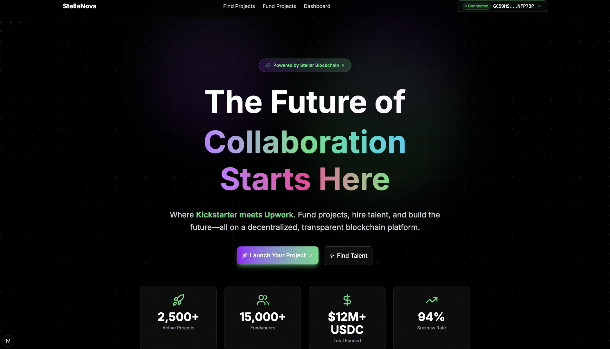
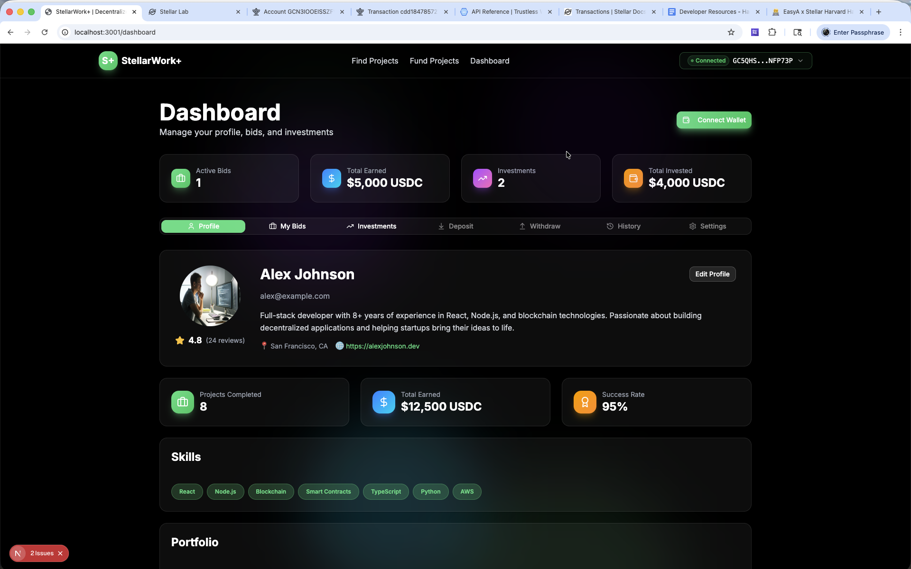
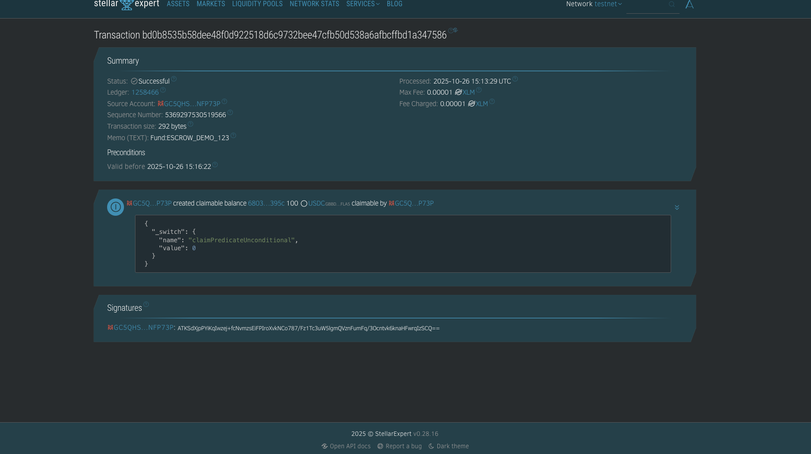

# 🌟 StellaNova - Decentralized Freelance Marketplace

> Where Kickstarter Meets Upwork on the Stellar Blockchain

**StellaNova** is a revolutionary three-sided marketplace connecting businesses, freelancers, and investors through secure escrow contracts powered by Stellar blockchain. Fund projects, hire talent, and build the future—all on a decentralized, transparent platform.


## 📸 Screenshots

### Home Page - Hero Section

*Modern landing page with animated blockchain video and interactive elements*

### Project Funding Interface

*Real-time funding with USDC escrow and Stellar testnet transactions*

### Anchor Provider Selection

*Choose trusted anchor providers for fiat-to-crypto conversion*

### Dashboard & Wallet

*Manage your projects, bids, investments, and USDC balance*

---

## 🎥 Presentation Video

Watch our complete platform demonstration and learn how StellaNova revolutionizes the freelance marketplace with Stellar blockchain technology:

https://github.com/user-attachments/assets/videofinal.mov

**Video Preview:**

<video width="100%" controls>
  <source src="public/video/videofinal.mov" type="video/quicktime">
  Your browser does not support the video tag. <a href="public/video/videofinal.mov">Download the presentation video</a>
</video>

*Full walkthrough covering wallet integration, project funding, escrow management, and USDC transactions on Stellar testnet*

---

## 📋 Table of Contents

- [Presentation Video](#-presentation-video)
- [Features](#-features)
- [Tech Stack](#-tech-stack)
- [Quick Start](#-quick-start)
- [Installation](#-installation)
- [Project Structure](#-project-structure)
- [Stellar Integration](#-stellar-integration)
- [Trustless Work Integration](#-trustless-work-integration)
- [Validation & Auto-Correction](#-validation--auto-correction)
- [Documentation](#-documentation)
- [Development](#-development)
- [Contributing](#-contributing)
- [License](#-license)

---

## ✨ Features

### 🎯 Core Platform

- **Three-Sided Marketplace**: Businesses post projects, freelancers bid, investors fund
- **Milestone-Based Payments**: Projects broken into verifiable milestones with escrow protection
- **Real-Time Funding**: Live funding progress with blockchain verification
- **Smart Bidding System**: Submit bids with USDC deposits
- **Crowdfunding Pools**: Multiple investors can fund projects collaboratively
- **Instant Payments**: Blockchain-powered payments in 5-7 seconds

### 🔐 Blockchain Features

- **Secure Escrow**: USDC funds locked in dedicated escrow accounts
- **Claimable Balances**: Secure fund releases to freelancers
- **Wallet Integration**: Freighter and Albedo wallet support
- **USDC Payments**: Stable cryptocurrency payments via Stellar testnet
- **Transaction Explorer**: View all transactions on Stellar Expert
- **Real-Time Balance**: Live XLM and USDC balance updates
- **XLM to USDC Swap**: Built-in DEX integration for currency conversion

### 💰 Fiat Gateway (SEP-24)

- **Deposit USDC**: Convert fiat to USDC via trusted anchors
- **Withdraw to Bank**: Convert USDC back to fiat currency
- **Multiple Anchors**: Choose from various anchor providers
- **Transaction History**: Track all deposits and withdrawals
- **Global Coverage**: Support for multiple currencies and regions

### 🛡️ Security & Validation

- **Memo Length Validation**: Automatic truncation to 28-byte limit
- **Balance Checks**: Validates sufficient funds before transactions
- **Trustline Verification**: Ensures USDC trustline exists
- **Error Recovery**: User-friendly error messages with solutions
- **Transaction Confirmation**: Review details before signing

---

## 🚀 Tech Stack

### Frontend
- **Next.js 15** - React framework with App Router
- **React 19** - Latest React with concurrent features
- **TypeScript** - Type-safe development
- **Tailwind CSS** - Utility-first styling with custom design system
- **Framer Motion** - Smooth animations and transitions
- **Shadcn/ui** - Beautiful, accessible component library
- **Lucide Icons** - Modern icon system

### Blockchain & Web3
- **Stellar SDK (@stellar/stellar-sdk)** - Core blockchain interactions
- **Freighter Wallet** - Browser wallet integration
- **Albedo Wallet** - Alternative wallet support
- **Stellar Wallets Kit** - Multi-wallet connectivity
- **USDC on Stellar** - Stablecoin payments
- **Claimable Balances** - Secure fund releases

### Fiat Gateway
- **SEP-24 Integration** - Stellar Ecosystem Proposal for deposits/withdrawals
- **Anchor Services** - Fiat-to-crypto conversion
- **MoneyGram Access** - Global fiat on/off ramps

### State Management & Data
- **React Hooks** - Custom hooks for wallet, escrow, and fiat balance
- **Context API** - Global state management
- **LocalStorage** - Client-side data persistence
- **Real-time Updates** - Live balance and transaction tracking

### Development Tools
- **ESLint** - Code linting and quality
- **TypeScript** - Full type safety
- **Sonner** - Beautiful toast notifications
- **Vercel** - Deployment and hosting

---

## 🚀 Quick Start

### Prerequisites

1. **Node.js 18+** and **npm** installed
2. **Stellar wallet** (Freighter or Albedo)
3. **Testnet XLM** and **USDC** (get from faucets)

### Installation

```bash
# Clone repository
git clone https://github.com/YOUR_USERNAME/EasyA-Hack_stellar.git
cd EasyA-Hack_stellar

# Install dependencies
npm install

# Setup environment
cp .env.local.example .env.local
# Edit .env.local with your configuration

# Run development server
npm run dev
```

Visit http://localhost:3000

### Get Testnet Funds

1. **Install Freighter**: https://freighter.app
2. **Switch to Testnet** in Freighter settings
3. **Get XLM**: https://laboratory.stellar.org/#account-creator
4. **Add USDC Trustline**: Use the deposit tab in StellaNova dashboard
5. **Get USDC**: Use the fiat gateway or swap XLM for USDC

---

## 📦 Installation

### Detailed Setup Guide

See **[STELLAR_INTEGRATION_GUIDE.md](./STELLAR_INTEGRATION_GUIDE.md)** for comprehensive setup instructions including:
- Node.js installation
- Wallet setup
- Testnet funding
- Environment configuration
- Troubleshooting

### Environment Variables

Create `.env.local` with:

```env
# Stellar Network
NEXT_PUBLIC_STELLAR_NETWORK=testnet
NEXT_PUBLIC_HORIZON_URL=https://horizon-testnet.stellar.org
NEXT_PUBLIC_SOROBAN_RPC_URL=https://soroban-testnet.stellar.org

# Trustless Work
NEXT_PUBLIC_TRUSTLESS_WORK_API=https://api.trustlesswork.com
NEXT_PUBLIC_TRUSTLESS_WORK_CONTRACT=<CONTRACT_ID>

# USDC
NEXT_PUBLIC_USDC_ASSET_CODE=USDC
NEXT_PUBLIC_USDC_ISSUER=<ISSUER_ADDRESS>
```

---

## 📁 Project Structure

```
StellarWork+/
├── app/                          # Next.js App Router pages
│   ├── page.tsx                  # Home page with featured projects
│   ├── layout.tsx                # Root layout with providers
│   ├── browse/                   # Browse all projects
│   ├── post-project/             # Create new project
│   ├── project/[id]/             # Project detail & bidding
│   ├── dashboard/                # User dashboard
│   ├── my-bids/                  # Freelancer bids
│   └── my-investments/           # Investor portfolio
│
├── components/                   # React components
│   ├── wallet-connect.tsx        # Wallet connection UI
│   ├── navigation.tsx            # Top navigation bar
│   ├── gradient-background.tsx   # Animated backgrounds
│   └── ui/                       # Shadcn UI components
│
├── lib/                          # Utility libraries
│   ├── stellar/                  # Stellar blockchain integration
│   │   ├── config.ts             # Network configuration
│   │   ├── wallet.ts             # Wallet operations
│   │   ├── trustless-work.ts     # Escrow management
│   │   ├── contracts.ts          # Smart contract utils
│   │   └── validation.ts         # Checkpoint system
│   └── utils.ts                  # General utilities
│
├── hooks/                        # Custom React hooks
│   ├── use-wallet.ts             # Wallet state management
│   └── use-toast.ts              # Toast notifications
│
├── public/                       # Static assets
├── styles/                       # Global styles
│
├── .env.local                    # Environment variables
├── package.json                  # Dependencies
├── tsconfig.json                 # TypeScript config
├── tailwind.config.ts            # Tailwind config
│
├── STELLAR_INTEGRATION_GUIDE.md  # Setup guide
├── GLM_PROMPTS.md                # AI prompting guide
└── README.md                     # This file
```

---

## ⛓️ Stellar Integration

### Wallet Connectivity

```typescript
import { useWalletKit } from '@/hooks/use-wallet-kit';

function Component() {
  const wallet = useWalletKit();
  
  // Connect wallet
  await wallet.connect();
  
  // Access wallet data
  console.log(wallet.publicKey);
  console.log(wallet.balance); // XLM
  console.log(wallet.usdcBalance); // USDC
  console.log(wallet.connected); // Connection status
  
  // Refresh balance
  await wallet.refreshBalance();
  
  // Disconnect
  wallet.disconnect();
}
```

### Creating Escrows

```typescript
import { createEscrow } from '@/lib/stellar/escrow';

const escrow = await createEscrow({
  clientAddress: 'GXXX...',
  freelancerAddress: 'GYYY...', // Optional - can be assigned later
  totalBudget: 1000,
  milestones: [
    { id: 'milestone-0', title: 'Design', budget: 400, description: '...', status: 'pending' },
    { id: 'milestone-1', title: 'Development', budget: 600, description: '...', status: 'pending' }
  ],
  projectId: 'project-123'
}, 'freighter');

console.log(escrow.escrowId);
console.log(escrow.escrowAddress);
console.log(escrow.transactionHash);
```

### Funding Projects

```typescript
import { fundEscrow } from '@/lib/stellar/escrow';

const result = await fundEscrow(
  'escrow-project-123',
  '100', // Amount in USDC
  'GINVESTOR...', // Investor address
  'freighter'
);

console.log(result.transactionHash);
// View on explorer: https://stellar.expert/explorer/testnet/tx/{hash}
```

### XLM to USDC Swap

```typescript
import * as StellarSDK from '@stellar/stellar-sdk';
import { signAndSubmitTransaction } from '@/lib/stellar/wallet';

const server = new StellarSDK.Horizon.Server('https://horizon-testnet.stellar.org');
const sourceAsset = StellarSDK.Asset.native();
const destAsset = new StellarSDK.Asset('USDC', 'GBBD47IF6LWK7P7MDEVSCWR7DPUWV3NY3DTQEVFL4NAT4AQH3ZLLFLA5');

// Find swap path
const paths = await server.strictSendPaths(sourceAsset, '100', [destAsset]).call();
const bestPath = paths.records[0];

// Build and submit transaction
const account = await server.loadAccount(publicKey);
const transaction = new StellarSDK.TransactionBuilder(account, {
  fee: StellarSDK.BASE_FEE,
  networkPassphrase: StellarSDK.Networks.TESTNET,
})
  .addOperation(
    StellarSDK.Operation.pathPaymentStrictSend({
      sendAsset: sourceAsset,
      sendAmount: '100',
      destination: publicKey,
      destAsset: destAsset,
      destMin: (parseFloat(bestPath.destination_amount) * 0.99).toFixed(7),
    })
  )
  .setTimeout(180)
  .build();

const result = await signAndSubmitTransaction(transaction, 'freighter');
```

---

## 🤝 Trustless Work Integration

### API Integration

StellarWork+ integrates with Trustless Work for:
- **Escrow Creation**: Deploy escrow smart contracts
- **Milestone Management**: Track and release payments
- **Yield Generation**: Earn interest on locked funds
- **Dispute Resolution**: Handle conflicts on-chain

### Key Functions

```typescript
import {
  createEscrow,
  fundEscrow,
  releaseMilestone,
  getEscrowStatus,
  getEscrowYield
} from '@/lib/stellar/trustless-work';

// Create escrow
const escrow = await createEscrow(params);

// Fund project
await fundEscrow(escrowId, amount, investorAddress);

// Release milestone
await releaseMilestone(escrowId, milestoneId, clientAddress);

// Check status
const status = await getEscrowStatus(escrowId);

// Get yield data
const yield = await getEscrowYield(escrowId);
console.log(`APY: ${yield.apy}%, Earned: ${yield.earned} USDC`);
```

### Yield-Bearing Escrows

Enable `enableYield: true` when creating escrow to activate TrustYield integration:

```typescript
const escrow = await createEscrow({
  // ... other params
  enableYield: true  // Earn yield while funds locked
});
```

---

## ✅ Validation & Auto-Correction

### Checkpoint System

StellarWork+ includes 5 validation checkpoints that auto-correct common errors:

#### 1️⃣ Wallet Connection Validation
- ✅ Validates public key format
- ✅ Checks account exists on network
- ✅ Verifies sufficient balance
- 🔧 **Auto-correction**: Shows funding instructions if account doesn't exist

#### 2️⃣ Transaction Validation
- ✅ Validates transaction structure
- ✅ Checks sequence numbers
- ✅ Verifies fee amounts
- 🔧 **Auto-correction**: Rebuilds transaction with correct sequence

#### 3️⃣ Escrow Creation Validation
- ✅ Validates client/freelancer addresses
- ✅ Checks budget amounts
- ✅ Validates milestone structure
- ✅ Verifies client balance
- 🔧 **Auto-correction**: Suggests budget adjustments if insufficient

#### 4️⃣ Auto-Retry System
- ✅ Retries failed operations 3 times
- ✅ Exponential backoff (2 seconds delay)
- ✅ Shows progress to user
- 🔧 **Auto-correction**: Handles temporary network issues

#### 5️⃣ Contract Call Validation
- ✅ Validates contract ID format
- ✅ Checks method names
- ✅ Validates arguments
- 🔧 **Auto-correction**: Provides helpful error messages

### Usage

```typescript
import { executeWithRetry, runCheckpoints } from '@/lib/stellar/validation';

// Auto-retry operation
const result = await executeWithRetry(
  async () => createEscrow(params),
  { maxRetries: 3, retryDelay: 2000, autoCorrect: true }
);

// Run multiple checkpoints
const { allPassed, results } = await runCheckpoints([
  () => validateWalletConnection(publicKey),
  () => validateTransaction(tx),
  () => validateEscrowCreation(params)
]);
```

---

## 📚 Documentation

### Guides

- **[STELLAR_INTEGRATION_GUIDE.md](./STELLAR_INTEGRATION_GUIDE.md)** - Complete setup and integration guide
- **[GLM_PROMPTS.md](./GLM_PROMPTS.md)** - AI prompting strategies for development

### Resources

- **Stellar Docs**: https://developers.stellar.org
- **Soroban Docs**: https://soroban.stellar.org
- **Trustless Work**: https://github.com/Trustless-Work
- **Freighter Wallet**: https://freighter.app

---

## 🛠️ Development

### Available Scripts

```bash
# Development
npm run dev          # Start development server

# Production
npm run build        # Build for production
npm start            # Start production server

# Code Quality
npm run lint         # Run ESLint
npm run type-check   # TypeScript checking
```

### Adding New Features

See **[GLM_PROMPTS.md](./GLM_PROMPTS.md)** for optimized prompts to use with GLM 4.6 AI for building new features.

Example workflow:
1. Choose feature prompt from GLM_PROMPTS.md
2. Customize with your requirements
3. Generate code with GLM 4.6
4. Test with checkpoint validation
5. Verify on Stellar testnet

### Testing

```bash
# Run checkpoint validation
npm run test:checkpoints

# Test wallet connection
# 1. Start dev server
# 2. Click "Connect Wallet"
# 3. Check console for checkpoint logs

# Test escrow creation
# 1. Connect wallet
# 2. Fill post-project form
# 3. Submit and check validation
# 4. Verify on Stellar Expert
```

---

## 🤝 Contributing

We welcome contributions! Here's how:

1. **Fork the repository**
2. **Create feature branch**: `git checkout -b feature/amazing-feature`
3. **Follow code patterns** from existing files
4. **Add checkpoint validation** for new features
5. **Test thoroughly** on testnet
6. **Commit changes**: `git commit -m 'Add amazing feature'`
7. **Push to branch**: `git push origin feature/amazing-feature`
8. **Open Pull Request**

### Code Standards

- Use TypeScript for all new code
- Follow existing naming conventions
- Add JSDoc comments for functions
- Include error handling and validation
- Test with checkpoint system
- Update documentation

---

## 📄 License

This project is licensed under the MIT License - see the [LICENSE](LICENSE) file for details.

---

## 🙏 Acknowledgments

- **Stellar Development Foundation** - For the amazing blockchain platform
- **Trustless Work** - For the escrow infrastructure
- **Freighter Team** - For the wallet integration
- **Shadcn** - For beautiful UI components
- **Vercel** - For Next.js and deployment platform

---

## 📞 Support

- **Issues**: [GitHub Issues](https://github.com/lifafa03/EasyA-Hack_stellar/issues)
- **Discussions**: [GitHub Discussions](https://github.com/lifafa03/EasyA-Hack_stellar/discussions)
- **Stellar Community**: [Stellar Discord](https://discord.gg/stellar)

---

## 🗺️ Roadmap

### ✅ Completed
- [x] Project structure and UI/UX
- [x] Stellar SDK integration
- [x] Wallet connectivity (Freighter/Albedo)
- [x] Trustless Work escrow integration
- [x] Smart contract interaction layer
- [x] Validation checkpoint system
- [x] Auto-correction and retry logic
- [x] Documentation and guides

### 🚧 In Progress
- [ ] Real escrow deployment on post-project
- [ ] USDC payment system with trustlines
- [ ] Real-time blockchain data sync

### 📋 Planned
- [ ] On-chain bidding system
- [ ] Yield-bearing investor pooling
- [ ] Dispute resolution UI
- [ ] Reputation system
- [ ] Mobile app (React Native)
- [ ] Mainnet deployment

---

## 🌟 Star History

If you find this project useful, please consider giving it a star! ⭐

---

**Built with ❤️ for the decentralized future of work**

*StellarWork+ - Where Work Meets Funding on Stellar* 🚀
